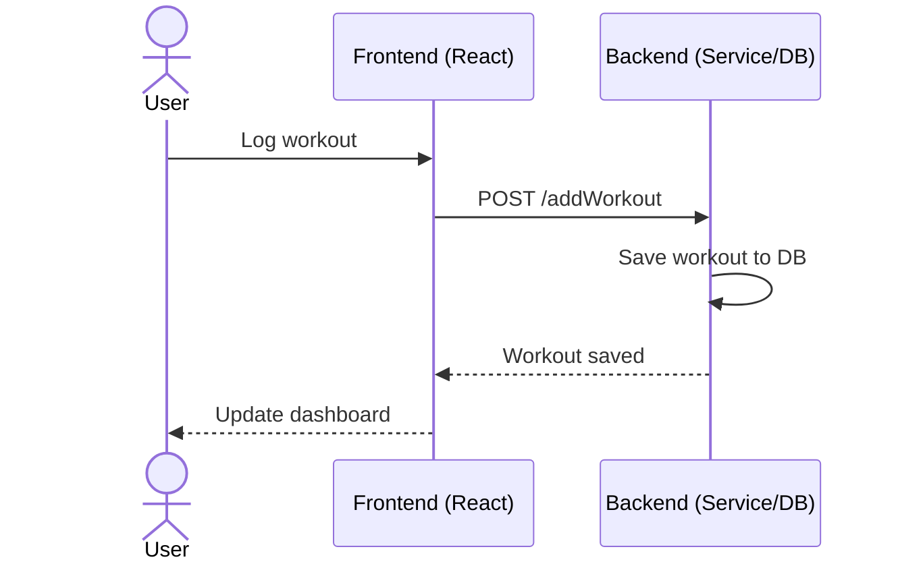

# FitnessBuddy

[My Notes](notes.md)

The FitnessBuddy application is a fitness tracking app that also allows for users to connect with their friends. As users log new workouts they've completed, the app updates a leaderboard that shows the users who have spent the most time working out. There is also a small weather feature that allows for users to see what the conditions are if they want to do an outdoor workout.

## 🚀 Specification Deliverable

For this deliverable I did the following. I checked the box `[x]` and added a description for things I completed.

- [X] Proper use of Markdown
- [X] A concise and compelling elevator pitch
- [X] Description of key features
- [X] Description of how you will use each technology
- [X] One or more rough sketches of your application. Images must be embedded in this file using Markdown image references.

### Elevator pitch

Do you need a little extra push to meet your fitness goals? With the FitnessBuddy app, you can create challenges and log your workouts to see the progress you make along the way. You can even compete in exercise challenges with your friends in real time to see who is the best!

### Design

Initial sketches for each page supported in the app:

#### Login/Register

#### Dashboard

#### Log Workout

#### Leaderboard

#### Sequence Diagram
The diagram below shows the basic flow of how a user logs a workout. The user enters workout details in the frontend, which are then sent to the backend service. The backend saves the workout in the database and returns a confirmation, allowing the frontend to update the user’s dashboard with the new data.

### Key features

- Secure login over HTTPS
- Ability to log workout with detailed information
- Create and join personal or group challenges
- Real-time leaderboard updates with each workout completed by your friends
- Dashboard displays progress as users log more workouts
- Current weather displays help users plan outdoor workouts
- Exercise data and user accounts are persistently stored

### Technologies

I am going to use the required technologies in the following ways.

- **HTML** - Four different HTML pages for login, dashboard, workout logs, and leaderboard.
- **CSS** - Visually appealing pages that use good color choice and sizing to display leaderboards and other stats associated with the workout logs.
- **React** - Provides login, displays dashboard and leaderboard, logs workouts, displays weather, and handles navigation between pages.
- **Service** - Backend endpoints include:
    - Login
    - Workout logs
    - Obtaining third party weather information
    - Fetching leaderboard results
- **DB/Login** - Store users, workouts, and stats in a secure manner.
- **WebSocket** - Push real-time updates for:
    - Logged Workouts
    - Leaderboard Changes

## 🚀 AWS deliverable

For this deliverable I did the following. I checked the box `[x]` and added a description for things I completed.

- [X] **Server deployed and accessible with custom domain name** - [My server link](https://turley260.me). I registered this domain, and used it to replace my elastic IP address.

## 🚀 HTML deliverable

For this deliverable I did the following. I checked the box `[x]` and added a description for things I completed.

- [X] **HTML pages** - I made four separate HTML pages for this startup application. The pages are: Login, Dashboard, New Workout, Leaderboard.
- [X] **Proper HTML element usage** - I used many different HTML element tags, such as header, main, body, footer, section, etc.
- [X] **Links** - I have three of the pages linked clearly in the navigation section of each page. The new workout page is designed to only be accessible from the dashboard page. 
- [X] **Text** - I clearly and concisely described the function of each of my pages, and the function of each of my placeholders.
- [X] **3rd party API placeholder** - I included my 3rd party placeholder on the dashboard page, as that is where I will be displaying the weather information that is pulled from the 3rd party.
- [X] **Images** - I added little clipart images of a dumbbell on the new workout log page, and of a trophy on the leaderboard page.
- [X] **Login placeholder** - There is a clear login feature using a username and password that will be inputted from the User.
- [X] **DB data placeholder** - I included the database placeholder on my dashboard page, where it will be used to show the total number of workouts completed by the user.
- [X] **WebSocket placeholder** - I included the WebSocket placeholder on the leaderboard page, as I will be pulling the workout statistics in real time to rank and display on the leaderboard.

## 🚀 CSS deliverable

For this deliverable I did the following. I checked the box `[x]` and added a description for things I completed.

- [X] **Header, footer, and main content body** - I made a stardard style for the header, body, and footer that I used for each page of my startup. The header and footer both are a forest green color, with white text, while the main body section is a light gray color.
- [X] **Navigation elements** - I have three links that are consistently in the navigation area of the header. These links take the user to the login page, the dashboard page, and the leaderboard page.
- [X] **Responsive to window resizing** - I used flexbox to make my header and footer consistent heights, even when the window size is adjusted. I set a minimum width for the window, but not a minimum height. Some of the features on the pages (such as text input boxes) even resize when the size of the window is changed.
- [X] **Application elements** - I included a variety of application elements, such as input fields, buttons, navigation links, and others. Each of these is styled in a way where they look good and function properly.
- [X] **Application text content** - I styled my pages in a way where all of the text looks visually pleasing. I made sure to make text color white on the darker backgrounds I used, and the text looks like the font is consistent across all of the pages.
- [X] **Application images** - I have two images included throughout the website, with each one centered and spaced nicely. I made sure to use images with transparent backgrounds so the image would look good even when positioned on a colored background.

## 🚀 React part 1: Routing deliverable

For this deliverable I did the following. I checked the box `[x]` and added a description for things I completed.

- [ ] **Bundled using Vite** - I did not complete this part of the deliverable.
- [ ] **Components** - I did not complete this part of the deliverable.
- [ ] **Router** - I did not complete this part of the deliverable.

## 🚀 React part 2: Reactivity deliverable

For this deliverable I did the following. I checked the box `[x]` and added a description for things I completed.

- [ ] **All functionality implemented or mocked out** - I did not complete this part of the deliverable.
- [ ] **Hooks** - I did not complete this part of the deliverable.

## 🚀 Service deliverable

For this deliverable I did the following. I checked the box `[x]` and added a description for things I completed.

- [ ] **Node.js/Express HTTP service** - I did not complete this part of the deliverable.
- [ ] **Static middleware for frontend** - I did not complete this part of the deliverable.
- [ ] **Calls to third party endpoints** - I did not complete this part of the deliverable.
- [ ] **Backend service endpoints** - I did not complete this part of the deliverable.
- [ ] **Frontend calls service endpoints** - I did not complete this part of the deliverable.
- [ ] **Supports registration, login, logout, and restricted endpoint** - I did not complete this part of the deliverable.

## 🚀 DB deliverable

For this deliverable I did the following. I checked the box `[x]` and added a description for things I completed.

- [ ] **Stores data in MongoDB** - I did not complete this part of the deliverable.
- [ ] **Stores credentials in MongoDB** - I did not complete this part of the deliverable.

## 🚀 WebSocket deliverable

For this deliverable I did the following. I checked the box `[x]` and added a description for things I completed.

- [ ] **Backend listens for WebSocket connection** - I did not complete this part of the deliverable.
- [ ] **Frontend makes WebSocket connection** - I did not complete this part of the deliverable.
- [ ] **Data sent over WebSocket connection** - I did not complete this part of the deliverable.
- [ ] **WebSocket data displayed** - I did not complete this part of the deliverable.
- [ ] **Application is fully functional** - I did not complete this part of the deliverable.
